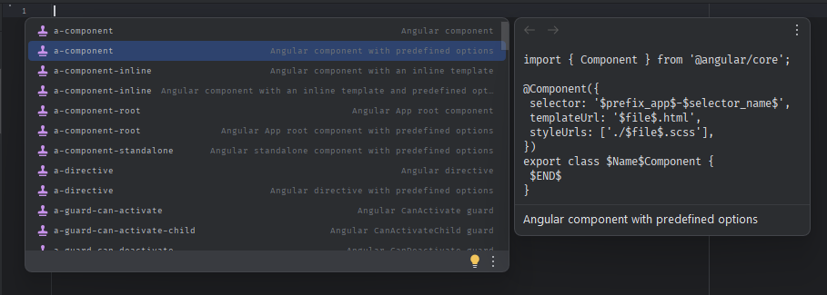
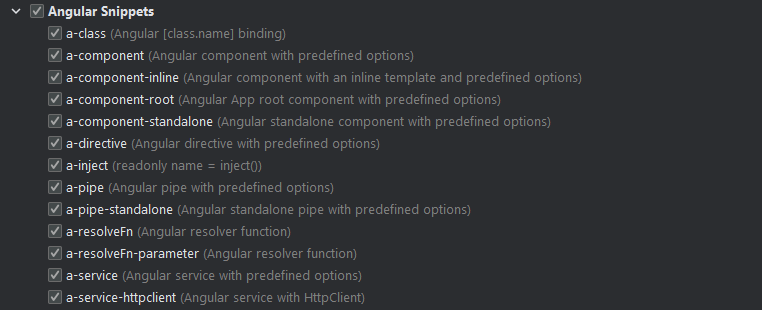

# Angular Snippets

## Overview

<!-- Plugin description -->

The Angular Snippets WebStorm Plugin is a powerful tool designed to enhance your development experience with WebStorm by providing a collection of live templates specifically tailored for Angular development. These live templates aim to boost your productivity by offering quick and easy access to common Angular code snippets.

| Trigger                  | Description                                                      |
|--------------------------|------------------------------------------------------------------|
| `a-class`                | Angular [class.name] binding                                     |
| `a-component`            | Angular component with predefined options                        |
| `a-component-inline`     | Angular component with an inline template and predefined options |
| `a-component-root`       | Angular App root component with predefined options               |
| `a-component-standalone` | Angular standalone component with predefined options             |
| `a-directive`            | Angular directive with predefined options                        |
| `a-inject`               | readonly name = inject()                                         |
| `a-pipe`                 | Angular pipe with predefined options                             |
| `a-pipe-standalone`      | Angular standalone pipe with predefined options                  |
| `a-resolveFn`            | Angular resolver function                                        |
| `a-resolveFn-parameter`  | Angular resolver function by parameter                           |
| `a-service`              | Angular service with predefined options                          |
| `a-service-httpclient`   | Angular service with HttpClient                                  |

<!-- Plugin description end -->

## Features

- **Rich Collection of Angular Snippets**: Benefit from a comprehensive set of Angular live templates covering components, directives, services, and more.

- **Effortless Integration**: Seamlessly integrate the Angular Snippets plugin into your WebStorm IDE, ensuring a smooth development workflow.

- **Increased Productivity**: Save time and reduce repetitive typing by utilizing these pre-defined Angular code snippets for common patterns and structures.

- **Customizable Templates**: Tailor the live templates to fit your specific coding style and preferences.

## Installation

Follow these steps to install the Angular Snippets WebStorm Plugin:

1. Open WebStorm.

2. Navigate to `Preferences` (or `Settings` on Windows) > `Plugins`.

3. Click on the `Marketplace` tab.

4. Search for "Angular Snippets" and click `Install`.

5. Restart WebStorm to apply the changes.

## Usage

Once the Angular Snippets plugin is installed, you can start using the live templates in your Angular projects.

- Type the predefined shortcut for a specific snippet, and the plugin will expand it into the corresponding Angular code.

  For example, type `a-`, select live-template and press `Tab` to generate an Angular component template.

- Alternatively, use the shortcut `Ctrl + J` to display a menu for choosing live templates.

## Contributing

Contributions to the Angular Snippets WebStorm Plugin are welcome! If you have additional Angular snippets or improvements to existing ones, feel free to submit a pull request.

1. Fork the repository.
2. Create a new branch: `git checkout -b feature/new-snippet`.
3. Make your changes and commit them: `git commit -m 'Add new Angular snippet'`.
4. Push to the branch: `git push origin feature/new-snippet`.
5. Submit a pull request.

## Bug Reports and Feature Requests

If you encounter any bugs or have suggestions for new features, please [create an issue](link-to-issues) in our GitHub repository.

## License

This Angular Snippets WebStorm Plugin is licensed under the MIT License - see the [LICENSE.md](LICENSE.md) file for details.

## Contact

For any inquiries or issues, please contact with me:

[][linkedin]
[][email]
[][x]

[linkedin]: https://www.linkedin.com/in/KonradStepien/
[email]: mailto:kord.stp@gmail.com?subject=Hello%20Konrad,%20From%20Github
[x]: https://twitter.com/kordrad

Happy coding with Angular Snippets! 🚀
